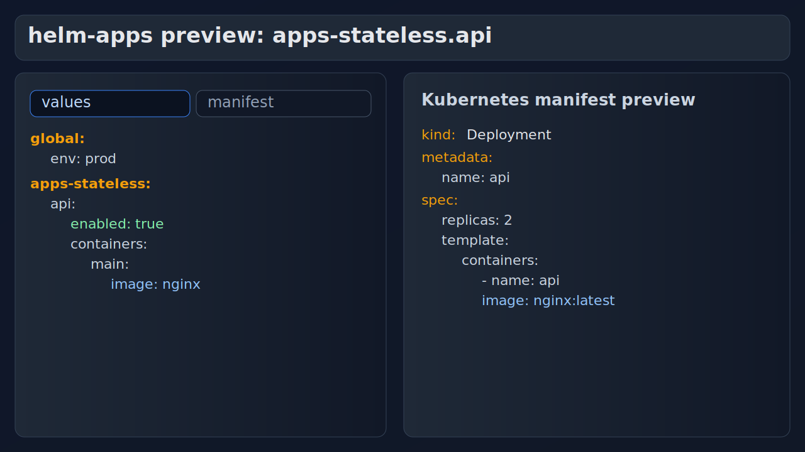
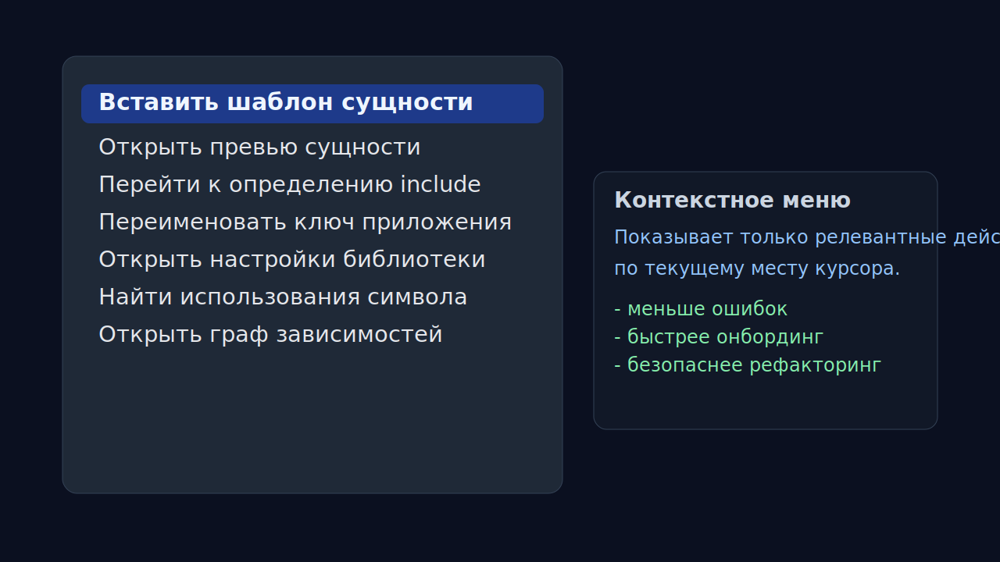
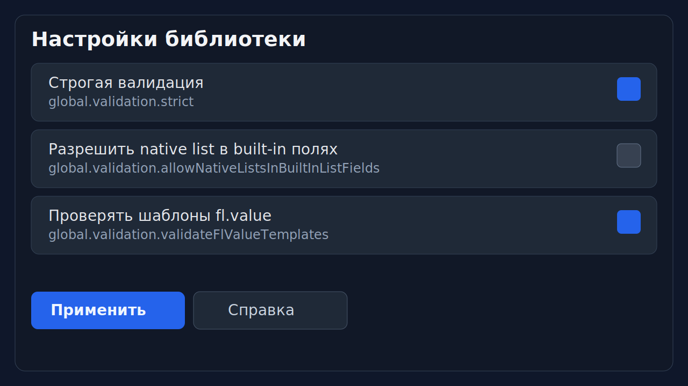

#  helm-apps VS Code Extension

  
  
  

Расширение для работы с `values.yaml` в формате `helm-apps` внутри VS Code.
Основная логика анализа и preview работает через `happ` LSP, а клиент в VS Code остаётся лёгким и быстрым.

## Навигация

- Быстрый старт: [Старт здесь](#старт-здесь-самый-короткий-путь)
- Визуальный обзор: [Как это выглядит](#как-это-выглядит)
- Практика: [Сценарии до/после](#сценарии-допосле)
- Возможности: [Ключевые возможности](#ключевые-возможности)
- Команды: [Команды расширения](#команды-расширения)
- Настройки: [Настройки](#настройки)
- Экосистема: [Связанные репозитории](#связанные-репозитории)

## Для кого и зачем

| Для роли | Что дает расширение |
|---|---|
| Разработчик | Быстрая навигация по values, hover-подсказки по полям, безопасные refactor-операции |
| DevOps / Platform | Предсказуемый preview сущностей и манифестов, диагностика контрактных ошибок, работа с include-графом |
| Onboarding | Шаблоны сущностей, визуальная структура values, меньше ручного поиска по документации |

## Старт здесь (самый короткий путь)

1. Установить расширение из [GitHub Releases](https://github.com/alvnukov/helm-apps-extensions/releases) (`.vsix`).
2. Убедиться, что `happ` доступен в `PATH` (или указать путь в `helm-apps.happPath`).
3. Открыть chart с `values.yaml` в формате `helm-apps`.
4. Выполнить команду `helm-apps: Configure YAML schema`.
5. Выполнить `helm-apps: Preview resolved entity (with includes)` и проверить `values/manifest` preview.

## Как это выглядит

### Preview сущности (values и manifest)

### Контекстные действия в редакторе

### Настройки библиотеки в UI

## Требования

- VS Code `>= 1.90`.
- Расширение YAML: `redhat.vscode-yaml`.
- `happ` в `PATH` (рекомендуется) или явный путь через настройку `helm-apps.happPath`.

Без `happ` остаются базовые клиентские функции, но продвинутый анализ и preview ограничены.

## Сценарии до/после

### 1) Поиск ошибки в values

До:
- ручной просмотр include-цепочек и env-map веток;
- много переключений между файлами.

После:
- открываете `Preview resolved entity`;
- сразу видите итоговую сущность и итоговый manifest;
- быстрее находите, где ломается контракт.

### 2) Навигация по include-профилям

До:
- grep по проекту и ручной поиск, где объявлен профиль.

После:
- `Go to include definition` на `_include`;
- `Find usages` по include/app символу;
- безопасное переименование через `Safe rename app key`.

### 3) Онбординг в новый chart

До:
- копирование YAML фрагментов из старых сервисов.

После:
- вставка шаблона сущности из контекстного меню;
- hover по полям с понятным описанием, типом и примером;
- структура `values` и настройки библиотеки доступны прямо в IDE.

## Ключевые возможности

| Возможность | Что делает |
|---|---|
| Schema auto-attach | Подключает `helm-apps` schema к `values*.yaml` |
| Entity preview (`values/manifest`) | Показывает итог сущности с учетом include/env resolution |
| Entity selector в preview | Переключение группа/app без закрытия окна preview |
| Navigation | `Go to include definition`, `Find usages`, `Rename symbol`, `Go to definition` |
| Refactor | `Extract app child to global include`, `Safe rename app key` |
| Visual structure | Дерево `helm-apps Values Structure` с переходом к ключу |
| Library settings UI | Панель настройки `global.*` c применением в `values.yaml` |
| Entity templates | Вставка шаблонов сущностей по группам |
| Dependency graph | Граф зависимостей `apps -> _include -> include files` |
| Clipboard import | `Paste as helm-apps` (конвертация из Kubernetes manifests через `happ`) |

## Команды расширения

Основные команды в Command Palette (`Cmd/Ctrl+Shift+P`):

- `helm-apps: Configure YAML schema`
- `helm-apps: Validate current values.yaml`
- `helm-apps: Preview resolved entity (with includes)`
- `helm-apps: Go to include definition`
- `helm-apps: Find symbol usages`
- `helm-apps: Open dependency graph`
- `helm-apps: Open library settings`
- `helm-apps: Generate library settings help`
- `helm-apps: Paste as helm-apps`
- `helm-apps: Extract app child to global include`
- `helm-apps: Safe rename app key`

## Настройки

- `helm-apps.languageServerMode`  
  `happ` (по умолчанию, рекомендуется) или `fallback`.
- `helm-apps.happPath`  
  Явный путь к бинарнику `happ`, если он не находится через `PATH`.
- `helm-apps.happLspArgs`  
  Аргументы запуска LSP (`["lsp"]` по умолчанию).
- `helm-apps.schemaFileMatch`  
  Маски файлов, для которых подключается schema.
- `helm-apps.disableYamlSchemaHover`  
  Скрывает generic schema-hover от YAML и оставляет контекстный hover `helm-apps`.

## Связанные репозитории

- Helm Apps Library: [alvnukov/helm-apps](https://github.com/alvnukov/helm-apps)
- happ CLI / LSP: [alvnukov/happ](https://github.com/alvnukov/happ)

## JetBrains (beta)

В репозитории добавлен JetBrains-плагин (MVP) в директории `jetbrains/`.
Он использует тот же `happ` LSP как общее ядро, что и VS Code клиент.

- Детали по плагину: [`jetbrains/README.md`](jetbrains/README.md)
- Архитектура multi-IDE ядра: [`docs/multi-ide-architecture.md`](docs/multi-ide-architecture.md)

## Лицензия

Apache-2.0, см. [LICENSE](LICENSE).
